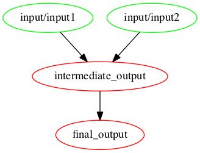

<h2>
	Data Workflows for:
	<ul style="list-style: none;">
		<li>Iteration</li>
		<li>Collaboration</li>
		<li>Reproducibility</li>
	</ul>
</h2>
<p>
(Open Data Science Conference)
<p>
<p>
	<small>
		<a href="http://davidchudzicki.com.com">David Chudzicki (Kaggle)</a>
		/
		<a href="http://twitter.com/dchudz">@dchudz</a>
	</small>
</p>

Note:

- data scientist w/ math stat background...
- (had the opportunity to interdisciplinary team w/ soft eng and ds) 
- one of the biggest eye-openers for me over the last few years
- happy to take questions throughout the talk
	+ (remember to pause before & after live demo)

----


--


Note:

- as often happens, quickly had complicated set of steps
- with
	- pre-processing
	- several models
	- many different feature sets we tried
	- lots of different kinds of outputs


--

## Informal data pipeline


Note: 

- at first very informal
- working with a couple colleagues
- mainly we just ran code, 
- told each other about it, 
- shared output in dropbox
- my colleage would ask me: are the corrected geological interpolations ready for me to feed into model?
- "yep they're in dropbox at customer5/geology/v6"
- "and the code is in the master branch on github?"
- no hold on let me push...
- most of all: "which of your scripts comes first? which input data do I need?"
- not ideal for us...

--

## Difficult to join project


Note:

- ... but it was even more difficult when new people came to join the project
- they didn't have any context around what steps get executed in what order
- they were mainly software engineers learning data science
- as we worked together, we figured out a good system for...

--

## Automated pipeline


Note:

- ... automating the pipeline
- Mostly will talk about our approach to that
- briefly want to first:
	- describe what goes wrong without a good pipeline workflow
	- describe what I think are the properties a good workflow should satisfy

--

Old code doesn't work anymore

Note:

- pipeline not automated ==> 
- not run frequently ==> 
- easy to break with no one knowing

--

Where did these results come from?

Note:

- Might be at a presentation
- Or looking at a report someone sends you
- Or even your own work
- ... and have a hard time figuring out where the results came from

--

Might not bother asking for details

Note:

- it is possible could ask you for details about your work
- And you might remember how it's all put together
- But even then, that might just be the small amount of friction that prevents them from 
	+ improving it
	+ building from it
	+ learning from it

--

Iterating is slow if executing downstream steps is tedious

Note:

- finally (but I think most importantly):
	+ let's say we change a data pre-processing step upstream
	+ we don't want it to be a pain to update model-building and everything else downstream

----

## What makes a good process?

--

Explicit 

Note:

- What outputs can we build?
- How are those built? 

--

Automated

--

Build only what we ask for

Note:

- mainly important for larger projects

--

Rebuild only when needed

Note:

- mainly important for larger projects

--

Allow working interactively

--

Visualize output conveniently

----

## Single Script?

<div style="width: 100%; overflow: hidden;">
	<div style="width: 300px; float: left;">
		<pre class="fragment" width="10%"><code data-trim>
do_step1()
do_step2()
do_step3()
do_step4()
do_step5()
do_step6()
		</code></pre>
	</div>
    <div style="margin-left: 420px;">
    	<ul style="list-style: none;">
			<li class="fragment">&#x2713; Explicit</li>
			<li class="fragment">&#x2713; Automated</li>
			<li class="fragment">&#x2717; Build only what we ask for</li>
			<li class="fragment">&#x2717; Rebuild only when needed</li>
		</ul>
	</div>

</div>

--


## Make

<div style="width: 100%; overflow: hidden;">
	<div style="width: 400px; float: left;">
	
	</div>
    <div style="margin-left: 420px;">
    	<ul style="list-style: none;">
			<li class="fragment">&#x2713; Explicit</li>
			<li class="fragment">&#x2713; Automated</li>
			<li class="fragment">&#x2713; Build only what we ask for</li>
			<li class="fragment">&#x2713; Rebuild only when needed</li>
			<li class="fragment">&#x2713; Allow working interactively
				<ul><ul>
					<li>(with tricks I'll show)</li>
				</ul></ul>
			</li>
			<li class="fragment">&#x2713; Visualize output easily
				<ul><ul>
					<li>(with Shiny)</li>
				</ul></ul>
</li>
		</ul>
	</div>

</div>


Note:

The problem of looking at what depends on what and building only what we need to is one software engineers encountered in the process of going from source code to software they distribute.

This is a problem software engineers have worked on!

--

## Make

```makefile
intermediate_output: input/input1 input/input2
	echo "We made an intermediate output" > intermediate_output

final_output: intermediate_output
	cp intermediate_output final_output
	echo "...and then we made the final output." >> final_output
```



--

At the shell:

```shell
make final_output
```


`final_output`:

```text
We made an intermediate output
...and then we made the final output.
```

----

## Example: Predict sale price of farm equipment


--


--

```stylus
# read data
train <- read_csv("working/train_test_split/train.csv")
test <- read_csv("working/train_test_split/test.csv")

# process features
train <- process_features(train)
test <- process_features(test)

```

--

```stylus
# read data
train <- read_csv("working/train_test_split/train.csv")
test <- read_csv("working/train_test_split/test.csv")

# process features
train <- process_features(train)
test <- process_features(test)

# fit model
feature_names <- c("saledate", "YearMade", "HorsePower", "ProductGroupDesc")
rf <- randomForest(train[feature_names], train$SalePrice, ntree=10)

# make predictions
test$Predicted <- predict(rf, test[feature_names])

```

--

```stylus
# read data
train <- read_csv("working/train_test_split/train.csv")
test <- read_csv("working/train_test_split/test.csv")

# process features
train <- process_features(train)
test <- process_features(test)

# fit model
feature_names <- c("saledate", "YearMade", "HorsePower", "ProductGroupDesc")
rf <- randomForest(train[feature_names], train$SalePrice, ntree=10)

# make predictions
test$Predicted <- predict(rf, test[feature_names])
	
# generate plot
ggplot(test) + 
  geom_point(aes(x=SalePrice, y=Predicted), alpha=.03) + 
  ggtitle("Actual vs. Predicted Sale Price") +
  xlab("Actual Sale Price ($)") +
  ylab("Predicted Sale Price ($)") +
  scale_y_continuous(labels = comma, limits=range(test$SalePrice)) +
  scale_x_continuous(labels = comma, limits=range(test$SalePrice)) +
  coord_fixed()
```

--

### Directories:

<ul>
	<li class="fragment">input</li>
	<li class="fragment">working</li>
	<li class="fragment">scripts</li>
	<li class="fragment">src</li>
</ul>


--

Makefile:

```makefile
working/predicted_vs_actual.png: scripts/model.R input/train.csv input/test.csv
	Rscript scripts/model.R input/train.csv input/test.csv working/predicted_vs_actual.png
```

<div class="fragment">
	<p>Equivalent:</p>
<pre width="10%"><code data-trim class="makefile">
working/predicted_vs_actual.png: scripts/model.R input/train.csv input/test.csv
	Rscript $^ $@
</code></pre>
	</div>

--

Makefile:

```makefile
working/predicted_vs_actual.png: scripts/model.R input/train.csv input/test.csv
	Rscript $^ $@
```

R:

```stylus
args <- command_args()
# args: 
# c("input/train.csv", "input/test.csv", "working/predicted_vs_actual.png")

train <- read_csv(args[1])
test <- read_csv(args[2])
output_file <- args[3]
.
.
.

ggsave(filename = output_file, plot = actual_predicted_plot)
```
--

Shell:

```shell
make working/predicted_vs_actual.png
```

Runs:

```
Rscript scripts/model.R input/train.csv input/test.csv working/predicted_vs_actual.png
```


--


<div style="width: 800px; float: left;">
	
</div>
<div style="margin-left: 420px;">
	
</div>

Note:

- want to tweak chart w/o rerunning the model
- separate into two steps


--

```makefile
working/test_predictions.csv: scripts/model.R input/train.csv input/test.csv
	Rscript $^ $@ 
```

--

```r
library(readr)
library(randomForest)
source("src/arg_helpers.R")
source("src/process_features.R")

args <- command_args()

train <- read_csv(args[1])
test <- read_csv(args[2])
output_file <- args[3]

# process features
train <- process_features(train)
test <- process_features(test)

# fit model
feature_names <- c("saledate", "YearMade", "HorsePower", "ProductGroupDesc")
rf <- randomForest(train[feature_names], train$SalePrice, ntree=10)

# make predictions
test$Predicted <- predict(rf, test[feature_names])

write_csv(test[c("SalePrice", "Predicted")], output_file)
```

--

```makefile
working/test_predictions.csv: scripts/model.R input/train.csv input/test.csv
	Rscript $^ $@

working/predicted_vs_actual.png: scripts/plot_predicted_vs_actual.R working/test_predictions.csv
	Rscript $^ $@ 

```
--

### Next:

- move plotting code to `scripts/plot_predicted_vs_actual.R`

<h3 class=fragment>
Live Demo	
</h3>

<ol>
	<li class="fragment">
	To show working interactively
	</li>
	<li class="fragment">
	To show rebuilding only as necessary
	</li>

	</ol>


Note:

- go to branch `two-make-steps-1`
- open `scripts/plot_predicted_vs_actual.R` (do ahead of
- In batch mode, we know where the input files are b/c they're fed in via make. 
	- How do we locate the input files?
	- How do we make sure they're there?

- to make sure the input files that a script needs are there, run the make step with "stop"

stop("Not ready to run!")

- print command args

args <- command_args()

- copy/paste args
- read data
- helper functions
- add chart:


<pre>
actual_predicted_plot <- ggplot(predictions) + 
  geom_point(aes(x=SalePrice, y=Predicted), alpha=.03) +
  ggtitle("Actual vs. Predicted Sale Price") +
  xlab("Actual Sale Price ($)") +
  ylab("Predicted Sale Price ($)") +
  scale_y_continuous(labels = comma, limits=range(predictions$SalePrice)) +
  scale_x_continuous(labels = comma, limits=range(predictions$SalePrice)) +
  coord_fixed()

ggsave(filename = output_file, plot = actual_predicted_plot)
</pre>

- add open to recipe

- Run as make step

<pre>
mae_string <- comma_format(digits=0)(mae$Evaluate(predictions$SalePrice, predictions$Predicted))

actual_predicted_plot <- 
  ggplot(predictions) + 
  geom_point(aes(x=SalePrice, y=Predicted), alpha=.01) +
  ggtitle(sprintf("Actual vs. Predicted Sale Price\nMAE: $%s", mae_string)) +
  xlab("Actual Sale Price ($)") +
  ylab("Predicted Sale Price ($)") +
  scale_y_continuous(labels = comma, limits=range(predictions$SalePrice)) +
  scale_x_continuous(labels = comma, limits=range(predictions$SalePrice)) +
  coord_fixed()

ggsave(filename = output_plot, plot = actual_predicted_plot)
</pre>

- (maybe demonstrate conttest?)

----

Loop over models

--


--

In `model.R`, replace this:

```stylus
.
.
.

train       <- read_csv(args[1])
test        <- read_csv(args[2])
output_file <- args[3]

.
.
.

# fit model
feature_names <- c("saledate", "YearMade", "HorsePower", "ProductGroupDesc")
rf <- randomForest(train[feature_names], train$SalePrice, ntree=10)

.
.
.
```

--

... with:

```stylus
.
.
.
train       <- read_csv(args[1])
test        <- read_csv(args[2])
model_name  <- args[3]
output_file <- ensure_parent_directory_exists(args[4])

model <- source_eval("src/models.R", models[[model_name]])
.
.
.
# fit model
feature_names <- c("saledate", "YearMade", "HorsePower", "ProductGroupDesc")
fitted <- model$fit(train, "SalePrice", feature_names)
  
# make predictions
test$Predicted <- model$predict(fitted, test)
.
.
.

```
	
--

```makefile
MODELS := rf lm

define make-model-targets

working/models/$(MODEL)/predicted_vs_actual.png: \
	scripts/plot_predicted_vs_actual.R working/models/$(MODEL)/test_predictions.csv
	Rscript $$^ $$@

working/models/$(MODEL)/test_predictions.csv: \
	scripts/model.R input/train.csv input/test.csv
	Rscript $$^ $(MODEL) $$@

actual-vs-predicted: working/models/$(MODEL)/predicted_vs_actual.png

endef

$(foreach MODEL,$(MODELS),$(eval $(call make-model-targets,$MODEL)))
```


--

Build in series:

```bash
make actual-vs-predicted
```

Build in parallel:

```bash
make -j4 actual-vs-predicted
```

--

Random Forest actual vs. predicted:


--

Linear Model actual vs. predicted:


--

	
--


--


```makefile
MODELS := rf lm

define make-model-targets

working/models/$(MODEL)/predicted_vs_actual.png: \
	scripts/plot_predicted_vs_actual.R working/models/$(MODEL)/test_predictions.csv
	Rscript $$^ $$@

working/models/$(MODEL)/test_predictions.csv: \
	scripts/model.R input/train.csv input/test.csv
	Rscript $$^ $(MODEL) $$@

working/models/model_performance.png: working/models/$(MODEL)/test_predictions.csv

actual-vs-predicted: working/models/$(MODEL)/predicted_vs_actual.png

endef

$(foreach MODEL,$(MODELS),$(eval $(call make-model-targets,$MODEL)))

working/models/model_performance.png: scripts/model_performance.R
	Rscript $(firstword $^) "$(wordlist 2, $(words $^), $^)" $@
```


----

```bash
Rscript \
	scripts/model_performance.R \
	"working/models/rf/test_predictions.csv working/models/lm/test_predictions.csv" \
	working/models/model_performance.png
```

--

In R:

```stylus
> args <- command_args()
> args
[1] "working/models/rf/test_predictions.csv working/models/lm/test_predictions.csv" 
[2] "working/models/model_performance.png"

> prediction_paths <- pipeline_input_file_vector(args[1])
> prediction_paths
[1] "working/models/rf/test_predictions.csv" 
[2] "working/models/lm/test_predictions.csv"
```

--


## Visualization

--

### Residuals:

(feature value) vs. (error)


Note:

1. we started out making lots of output charts
2. slow to open the right ones, compare, etc.
3. launch app

----

## Combatting Brittleness

--

Automatically run pipeline when I push to Github

--

Notifications in team chat room


----

## Slides & Example
