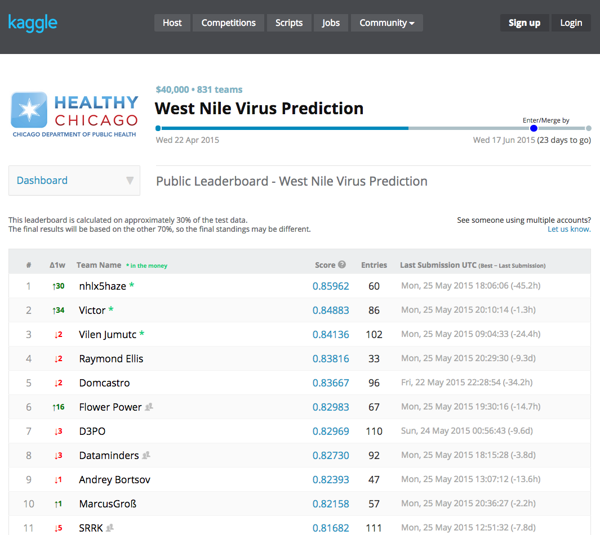
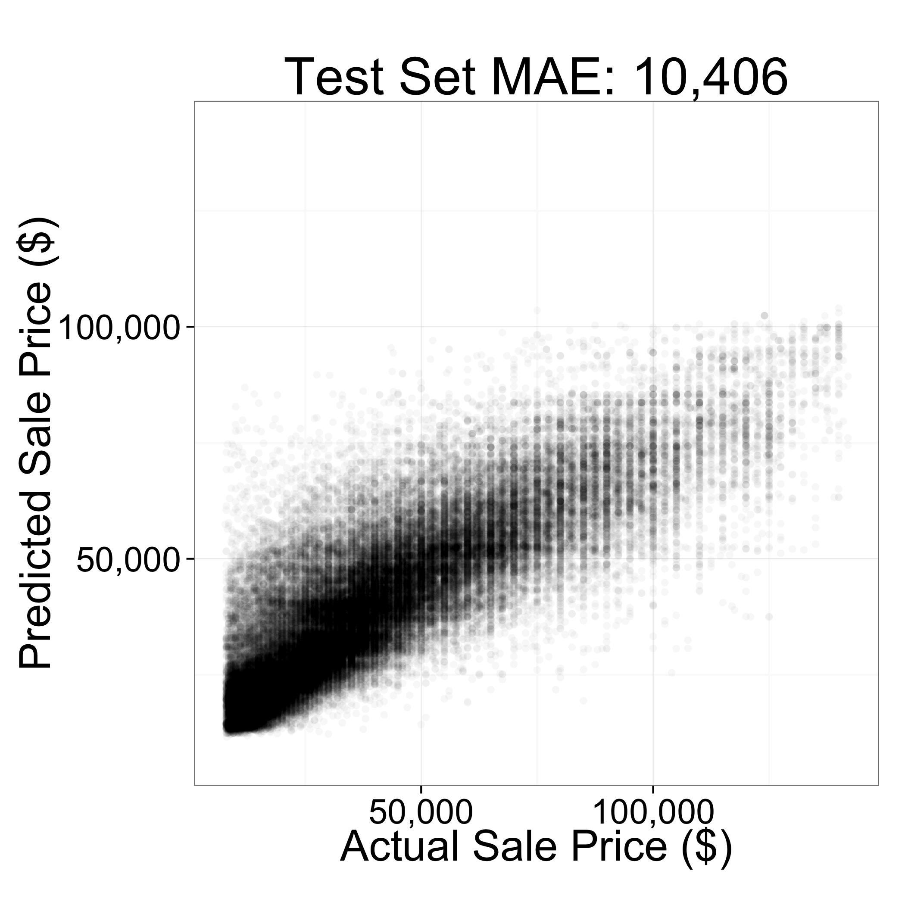
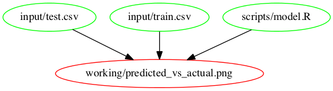
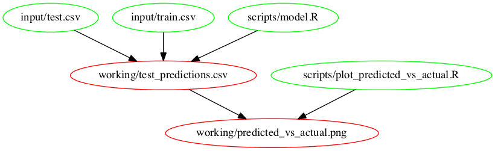
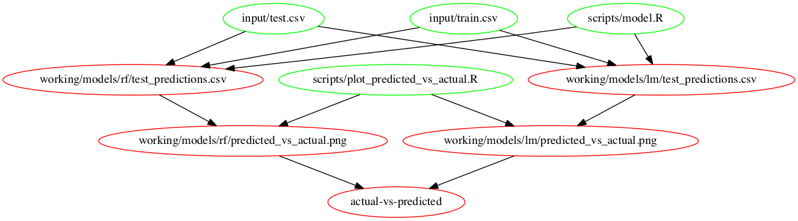
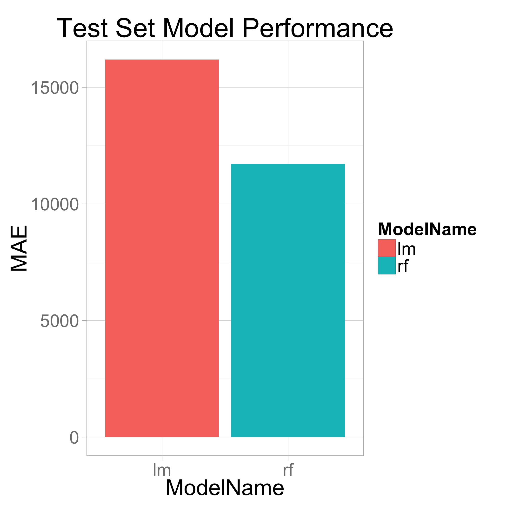
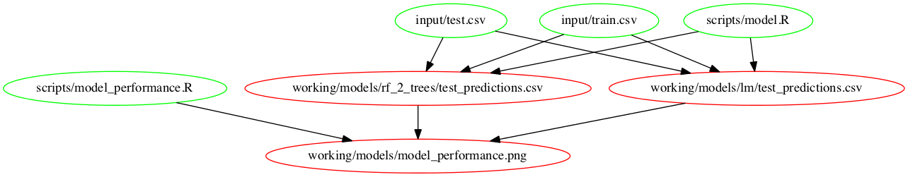

Outline

0. I'm going to tell you:
	- (quickly) why it's a problem that data scientists often aren't automating their analysis pipelines
	- show one approach to automating pipelines 
1. the problem
2. What experience am I drawing on? (briefly describe the team Kaggle had working on oil & gas)
3. Broad overview of what makes a good process
4. What's make?
5. Use example to demonstrate key ideas:
	- Getting started with a makefile
		- initial script fits a model and evaluates it on test set
	- Motivation for breaking into 2 steps: Want to adjust scoring metric w/o 
	- Break train/test into 2 steps
	- Add more metrics to test script (starting interactively)
		+ test script producers a chart showing metrics for each model
	- Loop over models (show off parallel execution)
	- Add step for partial plots (starting interactively)
	- Show how to reuse partial plot makefile code
	- Navigating so many results is hard - using Shiny app
6. Combatting brittleness by surfacing errors: 
	- Helper functions to make assertions about input types
	- Assertions about expected results
	- CI server
	- use of hipchat w/ CI server


----


<h2>
	Data Workflows for:
	<ul style="list-style: none;">
		<li>Iteration</li>
		<li>Collaboration</li>
		<li>Reproducibility</li>
	</ul>
</h2>
<p>
	<small>
		<a href="http://davidchudzicki.com.com">David Chudzicki (Kaggle)</a>
		/
		<a href="http://twitter.com/dchudz">@dchudz</a>
	</small>
</p>

Note:

For other data scientists to improve, build on, or even just trust your analysis, they need to be able to reproduce it. Even if you have shared code and data, reproducing your analysis may be difficult: which code was executed against which data in what order? And even if the steps are clear, rerunning downstream steps to see your new results after changes upstream can be a tedious process.

This talk will demonstrate the workflow and tools we used to increase our productivity and enjoyment by reducing grunt work and making it easier to build on each other's work. We used GNU Make as a clear way to represent what each step does, the inputs it depends on, and the output it produces. As we iterate on our analysis, makefiles allow us to conveniently execute only the steps that depend on code or other inputs that have changed since the last run. I'll walk through an example of creating a project, adding each step as a modular script, and reusing these scripts in different contexts. Since interactive exploration (and debugging) is a big part of data science, I'll demonstrate techniques for conveniently going back and forth between batch execution via makefiles and working interactively. 

----



--


--

## Informal data pipeline


--

## Difficult to join project


--

## Automated pipeline


Note:

Mostly will talk about how we appproached automating the pipeline, but first I want to talk about some of the other problems this approach addresses. Reproducibility...

--

Old code doesn't work anymore

--

Where did these results come from?

--

Might not bother asking for details

Note:

- Do you bother asking for details? (Will that be taken as doubt/criticism?)

- More likely to look into details (to build on or improve) if they're already open.

--

Iterating is slow if executing downstream steps is tedious

----

## What makes a good process?

--

Explicit 

Note:

- What outputs can we build?
- How are those built? 

--

Automated

--

Build only what we ask for

--

Rebuild only when needed

--

Allow working interactively

--

Visualize output conveniently

----

## Single Script?

<div style="width: 100%; overflow: hidden;">
	<div style="width: 400px; float: left;">
		<pre class="fragment"><code data-trim>
do_step1()
do_step2()
do_step3()
do_step4()
do_step5()
do_step6()
		</code></pre>
	</div>
    <div style="margin-left: 420px;">
    	<ul style="list-style: none;">
			<li class="fragment">&#x2713; Explicit</li>
			<li class="fragment">&#x2713; Automated</li>
			<li class="fragment">&#x2717; Build only what we ask for</li>
			<li class="fragment">&#x2717; Rebuild only when needed</li>
			<li class="fragment">&#x2754; Allow working interactively</li>
			<li class="fragment">&#x2754; Visualize output easily</li>
		</ul>
	</div>

</div>

--


## Make

<div style="width: 100%; overflow: hidden;">
	<div style="width: 400px; float: left;">
	
	</div>
    <div style="margin-left: 420px;">
    	<ul style="list-style: none;">
			<li class="fragment">&#x2713; Explicit</li>
			<li class="fragment">&#x2713; Automated</li>
			<li class="fragment">&#x2713; Build only what we ask for</li>
			<li class="fragment">&#x2713; Rebuild only when needed</li>
			<li class="fragment">&#x2713; Allow working interactively
				<ul><ul>
					<li>(with tricks I'll show)</li>
				</ul></ul>
			</li>
			<li class="fragment">&#x2713; Visualize output easily
				<ul><ul>
					<li>(with Shiny)</li>
				</ul></ul>
</li>
		</ul>
	</div>

</div>


Note:

This is a problem software engineers have worked on!

--

## Make

```makefile
intermediate_output: input/input1 input/input2
	echo "We made an intermediate output" > intermediate_output

final_output: intermediate_output
	cp intermediate_output final_output
	echo "...and then we made the final output." >> final_output
```


--

At the shell:

```shell
make final_output
```


----

## Example: Predict sale price of farm equipment


--

```stylus
# read data
train <- read_csv("working/train_test_split/train.csv")
test <- read_csv("working/train_test_split/test.csv")

# process features
train <- process_features(train)
test <- process_features(test)

```

--

```stylus
# read data
train <- read_csv("working/train_test_split/train.csv")
test <- read_csv("working/train_test_split/test.csv")

# process features
train <- process_features(train)
test <- process_features(test)

# fit model
feature_names <- c("saledate", "YearMade", "HorsePower", "ProductGroupDesc")
rf <- randomForest(train[feature_names], train$SalePrice, ntree=10)

# make predictions
test$Predicted <- predict(rf, test[feature_names])

```

--

```stylus
# read data
train <- read_csv("working/train_test_split/train.csv")
test <- read_csv("working/train_test_split/test.csv")

# process features
train <- process_features(train)
test <- process_features(test)

# fit model
feature_names <- c("saledate", "YearMade", "HorsePower", "ProductGroupDesc")
rf <- randomForest(train[feature_names], train$SalePrice, ntree=10)

# make predictions
test$Predicted <- predict(rf, test[feature_names])
	
# generate plot
ggplot(test) + 
  geom_point(aes(x=SalePrice, y=Predicted), alpha=.03) + 
  ggtitle("Actual vs. Predicted Sale Price") +
  xlab("Actual Sale Price ($)") +
  ylab("Predicted Sale Price ($)") +
  scale_y_continuous(labels = comma, limits=range(test$SalePrice)) +
  scale_x_continuous(labels = comma, limits=range(test$SalePrice)) +
  coord_fixed()
```

--


--

Makefile:

```makefile
working/predicted_vs_actual.png: scripts/model.R input/train.csv input/test.csv
	Rscript scripts/model.R input/train.csv input/test.csv
```

--

Makefile:

```makefile
working/predicted_vs_actual.png: scripts/model.R input/train.csv input/test.csv
	Rscript $^ $@
```

--

Makefile:

```makefile
working/predicted_vs_actual.png: scripts/model.R input/train.csv input/test.csv
	Rscript $^ $@
```

R:

```stylus
args <- command_args()
# args: 
# c("input/train.csv", "input/test.csv", "working/predicted_vs_actual.png")

train <- read_csv(args[1])
test <- read_csv(args[2])
output_file <- args[3]
.
.
.

ggsave(filename = output_file, plot = actual_predicted_plot)
```

Shell:

```shell
make working/predicted_vs_actual.png
```

--




--


<div style="width: 400px; float: left;">
	
</div>
<div style="margin-left: 420px;">
	
</div>

Note:

- want to tweak chart w/o rerunning the model
- separate into two steps


--

```makefile
working/test_predictions.csv: scripts/model.R input/train.csv input/test.csv
	Rscript $^ $@ 
```

--

(Live demo)

Note:

- `git checkout two-make-steps-1`
- Create make step:

working/predicted_vs_actual.png: scripts/plot_predicted_vs_actual.R working/test_predictions.csv
	Rscript $^ $@ 

- Open scoring script
- How do we run w/ the arguments? Execute make in command line w/ argument-printing
- Tweak interactively
- Run as make step

mae_string <- comma_format(digits=0)(mae$Evaluate(predictions$SalePrice, predictions$Predicted))

actual_predicted_plot <- 
  ggplot(predictions) + 
  geom_point(aes(x=SalePrice, y=Predicted), alpha=.01) +
  ggtitle(sprintf("Actual vs. Predicted Sale Price\nMAE: $%s", mae_string)) +
  xlab("Actual Sale Price ($)") +
  ylab("Predicted Sale Price ($)") +
  scale_y_continuous(labels = comma, limits=range(predictions$SalePrice)) +
  scale_x_continuous(labels = comma, limits=range(predictions$SalePrice)) +
  coord_fixed()

ggsave(filename = output_plot, plot = actual_predicted_plot)
 

- (maybe demonstrate conttest?)

----

Loop over models

--



--

In `fit.R`, replace this:

```stylus
.
.
.

train       <- read_csv(args[1])
test        <- read_csv(args[2])
output_file <- args[3]

.
.
.

# fit model
feature_names <- c("saledate", "YearMade", "HorsePower", "ProductGroupDesc")
rf <- randomForest(train[feature_names], train$SalePrice, ntree=10)

.
.
.
```

--

... with:

```stylus
.
.
.

train       <- read_csv(args[1])
test        <- read_csv(args[2])
model_name  <- args[3]
output_file <- ensure_parent_directory_exists(args[4])

model <- source_eval("src/models.R", models[[model_name]])

.
.
.

# fit model
feature_names <- c("saledate", "YearMade", "HorsePower", "ProductGroupDesc")
fitted <- model$fit(train, "SalePrice", feature_names)
  
# make predictions
test$Predicted <- model$predict(fitted, test)


.
.
.

```
	
--

```makefile
MODELS := rf lm

define make-model-targets

working/models/$(MODEL)/predicted_vs_actual.png: scripts/plot_predicted_vs_actual.R working/models/$(MODEL)/test_predictions.csv
	Rscript $$^ $$@

working/models/$(MODEL)/test_predictions.csv: scripts/model.R input/train.csv input/test.csv
	Rscript $$^ $(MODEL) $$@

actual-vs-predicted: working/models/$(MODEL)/predicted_vs_actual.png

endef

$(foreach MODEL,$(MODELS),$(eval $(call make-model-targets,$MODEL)))
```


--

(Demonstrate parallel make)


--

Random Forest actual vs. predicted:


--

Linear Model actual vs. predicted:


--

	
--



--


```makefile
MODELS := rf lm

define make-model-targets

working/models/$(MODEL)/predicted_vs_actual.png: scripts/plot_predicted_vs_actual.R working/models/$(MODEL)/test_predictions.csv
	Rscript $$^ $$@

working/models/$(MODEL)/test_predictions.csv: scripts/model.R input/train.csv input/test.csv
	Rscript $$^ $(MODEL) $$@

working/models/model_performance.png: working/models/$(MODEL)/test_predictions.csv

actual-vs-predicted: working/models/$(MODEL)/predicted_vs_actual.png

endef

$(foreach MODEL,$(MODELS),$(eval $(call make-model-targets,$MODEL)))

working/models/model_performance.png: scripts/model_performance.R
	Rscript $(firstword $^) "$(wordlist 2, $(words $^), $^)" $@
```

--

```bash
Rscript \
	scripts/model_performance.R \
	"working/models/rf/test_predictions.csv working/models/lm/test_predictions.csv" \
	working/models/model_performance.png
```

--

In R:

```stylus
> args
[1] "working/models/rf/test_predictions.csv working/models/lm/test_predictions.csv" 
[2] "working/models/model_performance.png"

> prediction_paths <- pipeline_input_file_vector(args[1])
> prediction_paths
[1] "working/models/rf/test_predictions.csv" 
[2] "working/models/lm/test_predictions.csv"
```

----

Visualization

--

```makefile
residuals-app:
	Rscript launch_app.R residuals "$^"
```

(demo)

1. we started out making lots of output charts
2. slow to open the right ones, compare, etc.
3. YearMade
4. ProductSize

----

## Combatting Brittleness

--

Pipeline argument helper functions

--

Assertions in scripts

--

CI server

--

Hipchat w/ CI server


----

--

## References

- Conda for reproducible environments: http://continuum.io/blog/conda-data-science
- Talk on how reproducibility saves you time: https://www.youtube.com/watch?v=7B3n-5atLxM

