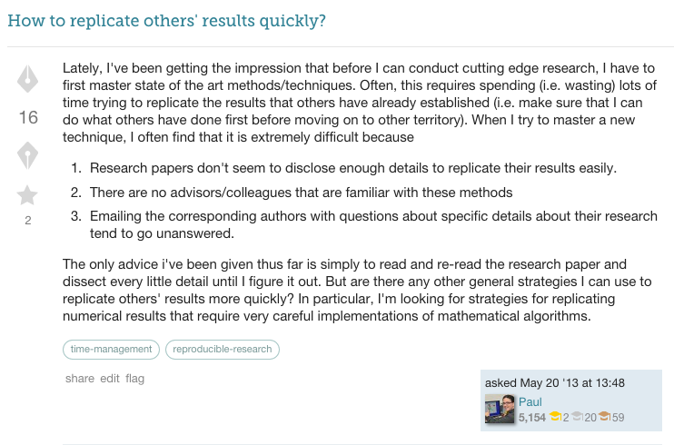
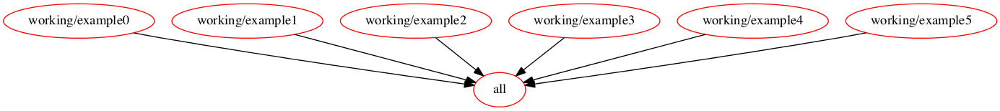

Outline

0. I'm going to tell you:
	- (quickly) why it's a problem that data scientists often aren't automating their analysis pipelines
	- show one approach to automating pipelines 
1. the problem
2. What experience am I drawing on? (briefly describe the team Kaggle had working on oil & gas)
3. Broad overview of what makes a good process
4. What's make?
5. Use example to demonstrate key ideas:
	- Getting started with a makefile
		- initial script fits a model and evaluates it on test set
	- Motivation for breaking into 2 steps: Want to adjust scoring metric w/o 
	- Break train/test into 2 steps
	- Add more metrics to test script (starting interactively)
		+ test script producers a chart showing metrics for each model
	- Loop over models (show off parallel execution)
	- Add step for partial plots (starting interactively)
	- Show how to reuse partial plot makefile code
	- Navigating so many results is hard - using Shiny app
6. Combatting brittleness by surfacing errors: 
	- Helper functions to make assertions about input types
	- Assertions about expected results
	- CI server
	- use of hipchat w/ CI server

D's comments:

Simpler title: Data Workflows to Iterate More Easily and Quickly

There are so many points of failure... we could mess one up so easily! All this stuff we're doing by hand, wasting our time, getting it wrong... we can make it happen automatically instead! and correctly!


----


<h2>
	Data Workflows for:
	<ul style="list-style: none;">
		<li>Iteration</li>
		<li>Collaboration</li>
		<li>Reproducibility</li>
	</ul>
</h2>
<p>
	<small>
		<a href="http://davidchudzicki.com.com">David Chudzicki (Kaggle)</a>
		/
		<a href="http://twitter.com/dchudz">@dchudz</a>
	</small>
</p>

Note:

For other data scientists to improve, build on, or even just trust your analysis, they need to be able to reproduce it. Even if you have shared code and data, reproducing your analysis may be difficult: which code was executed against which data in what order? And even if the steps are clear, rerunning downstream steps to see your new results after changes upstream can be a tedious process.

This talk will demonstrate the workflow and tools we used to increase our productivity and enjoyment by reducing grunt work and making it easier to build on each other's work. We used GNU Make as a clear way to represent what each step does, the inputs it depends on, and the output it produces. As we iterate on our analysis, makefiles allow us to conveniently execute only the steps that depend on code or other inputs that have changed since the last run. I'll walk through an example of creating a project, adding each step as a modular script, and reusing these scripts in different contexts. Since interactive exploration (and debugging) is a big part of data science, I'll demonstrate techniques for conveniently going back and forth between batch execution via makefiles and working interactively. 

From Anthony:

Tell two stories. (R&R then Allstate.)

Probly remove Stack Exchange examples.

Then go through the points showing how each one was illustrated in the story.

Why make vs. python shell script etc.?

Signpost shiny-- shouldn't come out of nowhere 
- gave the sense that make is the whole solution
- frame it as a solution w/ 2 pieces: make & shiny

in describing kaggle & consulting work -- paired data scientists w/ software engineers (emphasize as something giving me a unique view)

if using testing / CI server, signpost it.

make?
make+shiny?
make+shiny+ci?

----

## Kaggle

Note: 

Also did consulting

--

## Informal data pipeline

[picture of someone asking someone something]

--

## Difficult to join project

[picture of someone confused]

--

## Automated pipeline

[picture of happy people?]

Note:

Mostly will talk about how we appproached automating the pipeline, but first I want to talk about some of the other problems this approach addresses.

----

## Reproducibility

Reinhart & Rogoff

--

> A well-known study completed by economists Ken Rogoff and Carmen Reinhart confirms this common-sense conclusion. 

> <cite>2013 Republican Budget Proposal</cite>

--


--

> What should I do if I cannot reproduce experimental published results?
> 
> <cite>[StackExchange Question](https://academia.stackexchange.com/questions/20640/what-should-i-do-if-i-cannot-reproduce-experimental-published-results)</cite>

<div></div>

> ...trying to get exact agreement also on the details that they didn't describe in the original paper...
> 
> <cite>(Accepted Answer)</cite>

--




Note: 

https://academia.stackexchange.com/questions/10096/how-to-replicate-others-results-quickly


--

(Personal story of difficulty reproducing results at when I worked at an insurance company)

--

Old code doesn't work anymore

--


## Where did these results come from?

(Understanding where things came from is painful.)

- (Show big dependency graph. Emphasize that it's often just in people's heads.)

--

## Might not bother asking for details

Do you bother asking for details? (Will that be taken as doubt/criticism?)

More likely to look into details (to build on or improve) if they're already open.

--

## Slow iteration

Iterating is hard if executing downstream steps is tedious

----

## What makes a good process?

--

Explicit 

Note:

- What outputs can we build?
- How are those built? 

--

Automated

--

Build only what we ask for

--

Rebuild only when needed

--

## Rest of the talk:

- Individual scripts that each do one thing
- Tying these scripts to makefiles
- Conveniently going back and forth between: 
	- execution via makefile
	- interactive work
- Checks to make sure we notice when something unexpected happened
- How we made sure the code was run regularly

----

## Make

```makefile
intermediate_output: input/input1 input/input2
	echo "We made an intermediate output" > intermediate_output

final_output: intermediate_output
	cp intermediate_output final_output
	echo "...and then we made the final output." >> final_output
```



--

At the shell:

```shell
make final_output
```


----

## Example

Example R Script (fits a model w/ train.csv and evaluates w/ test.csv)

----

Move R script to makefile

```makefile
score.txt: train.csv test.csv
	Rscript train_and_test.R score.csv train.csv test.csv
```

Aside:

(Show how to avoid repition in output/input names)

----

Want to change the scoring function

Make training a separate step so we don't have to repeat it to add a scoring metric.

----

Interactively adjust scoring script

```r
...
if (interactive) ...
...
```

(Add more metrics. Output is a chart.)

- refactor if(interactive) to: get_args_else
	+ assign default args for interactive use
	+ get args from make
	+ print args from make in copy/pastable form (for debugging)

----

conttest for automatic rebuilds

As soon as a change is made, rebuild.

```bash
conttest 'make report.html' .
```

(Build `report.html` every time there is a change in the current directory)


----

Loop over feature sets, models

----

Make parallelism

(show off our loop)

Advantages of doing the parallelism here:

- OS takes care of scheduling
- No need to learn anything about how to put parallelism in your code
- Easier debugging

----

Partial Plots

- Want to do other things with the fitted model
	- predictions on new test sit
	- visualizations

(Start work interactively)

----

## [For output directories, use ".sentinel" files]?

```makefile
mydir/.sentinel: (dependencies)
	recipe
```

Need to update timestamp of `mydir/.sentinel` at the end of every script:

```r
touch_sentinel(mydir)
```

Could do this in recipe instead:

...

But doing it in the script has less duplication of code if we use the same script in multiple places.

----

Reusing make code - Plugging in pieces to the dependency graph

Uncouple both your scripts and makefile code from the particular application at hand.

in the makefile that gets included:

assert that `$(TRAIN_CSV)` variable is defined

`include`

----


## Input type assertions

In the Rscript:

```r
args = get_command_args()
#input_file = args[1]
input_file = input_file(args[1])
num_splits = input_integer(args[2])
```

----

## Assertions about results

(incorporating checks that automatically run after each step)

Replace 

```makefile
RSCRIPT = Rscript
```

with 

```makefile
RSCRIPT = (Ben's thing)
```

----

CI server: notifications that it broke 

----

CI server for sharing results 


----

## (Not part of presentation, this is just for my own reference)


should I discuss checking results into github (for easy side-by-side comparison)? 

https://team.kaggle.com/wiki/R
https://team.kaggle.com/wiki/Makefile.CodingStyle
